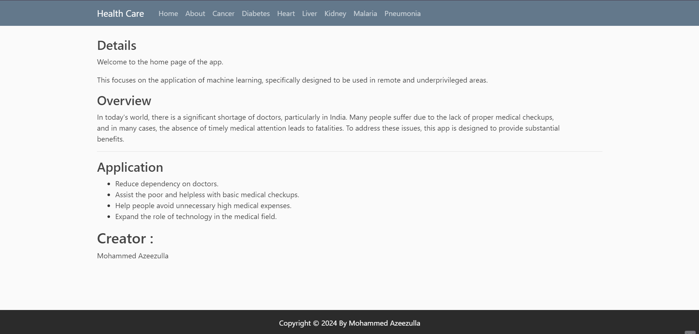
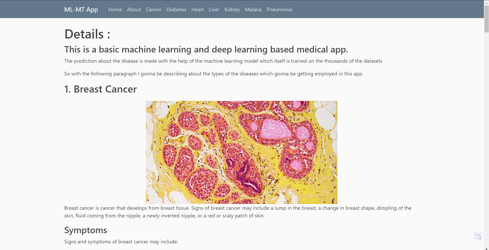

# Healthcare Application

This is a Healthcare Application designed to improve patient care by leveraging modern technologies. The application includes features for patient management, appointment scheduling, and more.

## Table of Contents

1. [Getting Started](#getting-started)
2. [Prerequisites](#prerequisites)
3. [Installation](#installation)
4. [Running the Application](#running-the-application)
5. [Datasets](#datasets)
6. [Acknowledgements](#acknowledgements)
7. [License](#license)

## Getting Started

Follow these instructions to get a copy of the project up and running on your local machine for development and testing purposes.

## Prerequisites

- Python 3.7 or higher
- Git

## Installation

1. **Clone the repository:**

   ```bash
   git clone https://github.com/zeeza18/Healthcare-Application.git
   cd Healthcare-Application

2. **Create a virtual environment:**

   ```bash
   python3 -m venv venv

3. **Activate the virtual environment:**

   - On Windows:

     ```bash
     .\\venv\\Scripts\\activate
     
   - On MacOS/Linux:

     ```bash
     source venv/bin/activate

4. **Install the required libraries:**

   ```bash
   pip install -r requirements.txt

## Running the Application

1. **Set environment variables (if any):**

   Make sure to set any required environment variables. For example:

   ```bash
   export FLASK_APP=app.py
   export FLASK_ENV=development   

2. **Run the Flask application:**

   ```bash
   flask run

   The application will be available at \`http://127.0.0.1:5000/\`.

## Datasets

### Kernels used for training deep learning models:

- **Kernel for Malaria model:** [Malaria Cell](https://www.kaggle.com/shobhit18th/malaria-cell)
- **Kernel for Pneumonia model:** [Keras NN X-Ray Predict Pneumonia](https://www.kaggle.com/shobhit18th/keras-nn-x-ray-predict-pneumonia-86-54)

### Details of various datasets used for model development:

- **Cancer:** cancer.csv (In the repository)
- **Diabetes:** diabetes.csv (In the repository)
- **Heart:** heart.csv (In the repository)
- **Liver:** [Indian Liver Patient Records](https://www.kaggle.com/uciml/indian-liver-patient-records)
- **Kidney:** [Chronic Kidney Disease](https://www.kaggle.com/mansoordaku/ckdisease)
- **Malaria:** [Cell Images for Detecting Malaria](https://www.kaggle.com/iarunava/cell-images-for-detecting-malaria)
- **Pneumonia:** [Chest X-Ray Pneumonia](https://www.kaggle.com/paultimothymooney/chest-xray-pneumonia)

## Acknowledgements

We would like to acknowledge Krish Naik for his invaluable guidance and contributions to this project.

## Application Images





## Diseases Panel


## License

This project is licensed under the MIT License. See the [LICENSE](LICENSE) file for details.

All datasets used in this project are licensed under their respective licenses. Please refer to the datasets' documentation for more information.
